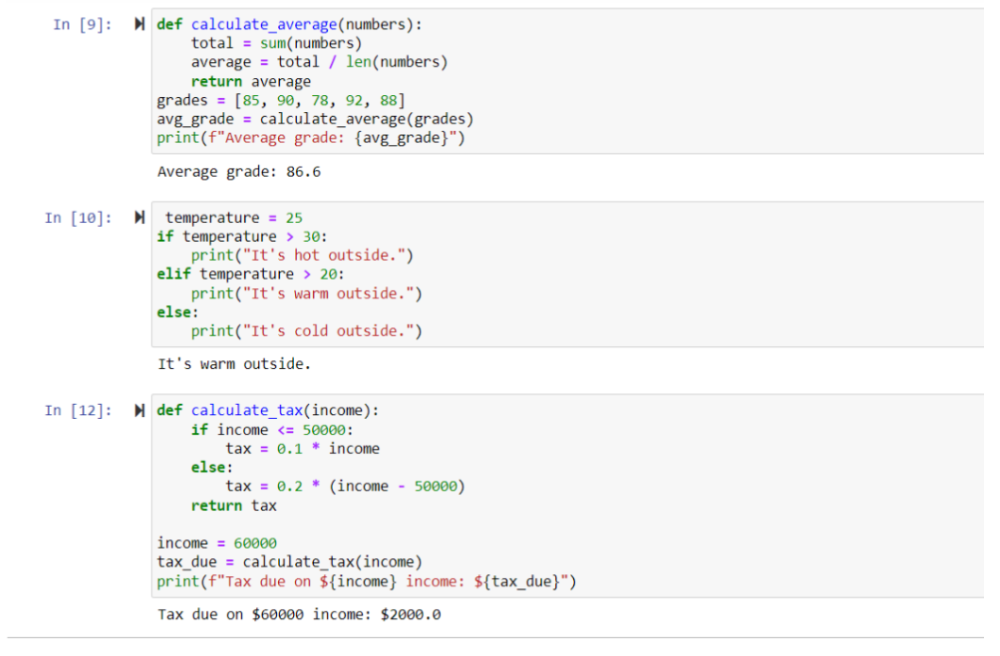

### Week 6 Plans
- ### Week 6 Plans
This week we went over many different things:
- We focused on filming our video on our team test
- In our video we talked about many different things

How we work well as a team: collaboration : Sreeja
What are the benefits of a team? Explain some of the diversities that your team has to offer.
Some of the benefits of working as a team is that each of us have a diverse set of skills and by working together we are expanding our skill set. We also each have to only put a little bit of work to go a long way because more hands gets the job done faster. Additionally with more members we are able to produce a better code because we are able to find errors faster, proving that more minds are better than one. Despite us all working well together we still have had to work on our agile methodology as we have to effectively map out each other's roles, give continuous deadlines to meet, and check in on each other to make sure everything is going well. 
nupur=backend-developer-really good at finding problems with the code and making changes to debug or fix it.
tanvi=backend-developer- really good at fixing the code and making changes to it
abigail=front-end developer= helps to make design changes to the page, changes colors, fonts, etc… really good at coming up with creative designs and also helps to find the errors with the codes
sreeja= scrum master- really good at organizing and communicating with the team and the teachers

Describe how you will facilitate communication amongst group members.
Have a groupchat, make plans to meet up and work together on the code, ex. Went to starbucks together to film and create the video and also to finish debugging the code
How will you hold each person accountable for their portion of the work? Think about dates, review tickets, and peer review.
Make sure everyone has an assigned role
In a weekly plan we will split up the work between the 4 of us 
Assign each member a peer partner who will review there work by the end of the week
	Make sure that they are actually doing the work
In the review ticket each person will discuss what they actually chose to do. 

Then, I talked about jupyter notebooks and the code that we made. 
To “make” a program with function and purpose, you need to “plan” a program with function and purpose. Build a Jupyter Notebook to show examples of the following.
Program with Output
Program with Input and Output
Program with a List
Program with a Dictionary
Program with Iteration
Program with a Function to perform mathematical and/or a statistical calculations.
Program with a Selection/Condition
Finish with a Program with Purpose

First, we have our dictionary
Here, you have these words, where each topic corresponds to another word
When you ask for the topic, it returns with the corresponding word
Tax
For this program, if your income is less that 50000
if else statement used in condition
important bc it could be used in real life 

Program design: abby
Share a program that you have expanded upon that was written by another. Show extensive documentation on that program (ie use ChatGPT for help). Here are some minimum requirements for Design and Development documentation.

During the tech talk, we were given a code that we needed to debug. This was found on the teacher repository, therefore it wasn’t our own code. In doing so we were able to identify and solve all the errors that we came across. 
When we tried to run this, it resulted in two outputs of the same number if it was both divisible by 2 and 5. So to fix this, we changed the variables “numbers” and “newNumbers” equal to set() to store numbers. Then changed the while loop so that it was “numbers.add(i)” not “numbers.append(i)” so that we could add elements to the set. Then we used the same format as the first code except for the previous changes. These changes helped debug the code and allowed for only one copy of an output to be printed.  Another code on the teacher repository that we were assigned to debug was one where the problem was that it printed out “0” as the total amount of money that the order costs at the end of the list. So to fix this error, we added in a while loop to show that when the statement is true the program will provide an output of the menu, and it will ask for the name of the menu item that you want to order, along with if you are done with your order. When you are done you type “done” and then it will take the information and add up the cost. In doing so it uses an if statement, so if the item is in the menu it adds the cost of the item to the total, and if not, then it will have an output statement of “Item is not found in the menu. Please choose a valid item.” Then it prints the total as an output. 

then we debugged our code:
Identyfing and Correct Errors
Often, when we develop code the initial functionality is very simple. However, when we consider invalid conditions when using our code we often increase the complexity of our code or functions.

Create a tester function that runs a program and validates its functionality.
Show comments and code logic that reduces errors in code with if / else statements.
Show comments and code logic that reduces errors in code with try / catch statements.
shows the user when the code doesn’t work sayijg error

Show in video how first chem game did not work, then added comments to reduce confusion and code logic allowed us to debug and make the interactive game work

