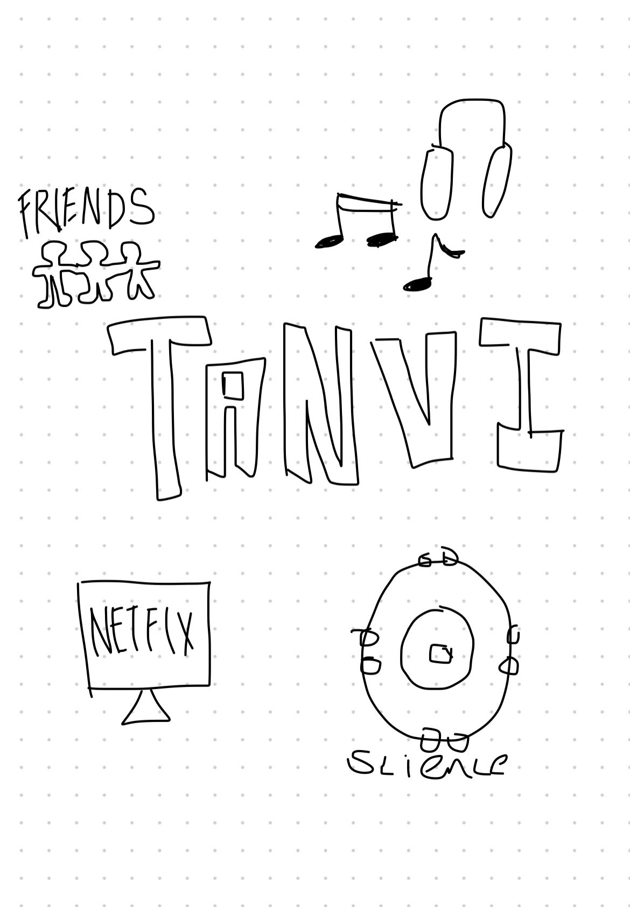

## **Tanvi's Homepage**
Welcome to my page!!

## **About Me**
Hi, I'm Tanvi and I am in 10th grade at Del Norte High School. I like to dance, run, learn, and hang out with my friends. This year I am taking AP Computer Science Principles, AP Calculus, AP Chemistry, Honors Humanities, and Honors Principles of Engineering. I have 4 people in my family, my mom, dad, and my younger brother who is 10 years old. 

## **Tools Installed**

- We downloaded VScode, made a GitHub account, and Slack account, Linux, Python, Ruby, Bundle, Jupiter, Docker, Anaconda, (tanvi) did WSL Ubuntu, and (abby) did Homebrew. 

## **Issues we faced**
- We went through some downloading issues, like downloading homebrew, so we had to reload it, then tried again and it worked. One of the problems that we faced was that we both had trouble with making a repository, and it constantly kept loading, so we were unable to continue with our project productively, as the time that we had was limited for this. We talked to the teacher, and we learned that we needed to put text into the box above the commit button, in order for it to work and save. Overall, we really collaborated together well, just to make sure that we were both on the same page, and we would help each other with any problems that the other person was facing. 
We made sure that we were both working well together, during class we would check in with each other during assignments so that we could move on together.

## _____________________________________________________________________________________________________________________________________________________________________________________________________________

- Plans, Lists, [Scrum Boards](https://clickup.com/blog/scrum-board/) help you to track key events, show progress and record time.  Effort is a big part of your class grade.  Show plans and time spent!
- [Hacks(Todo)](https://levelup.gitconnected.com/six-ultimate-daily-hacks-for-every-programmer-60f5f10feae) enable you to stay in focus with key requirements of the class.  Each Hack will produce Tangibles.
- Tangibles or [Tangible Artifacts](https://en.wikipedia.org/wiki/Artifact_(software_development)) are things you accumulate as a learner and coder. 
